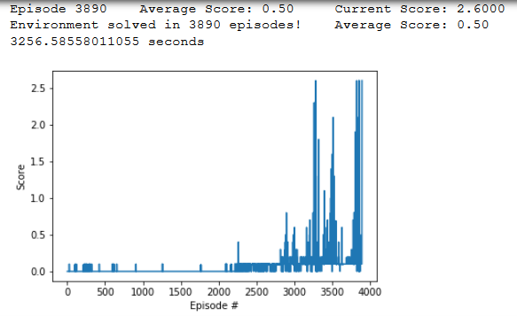

# Report to the Collaboration&Competition project

This report is written as a part of the Collaboration and Competition project of the [Deep Reinforcement Learning Udacity Nanodegree Program](https://eu.udacity.com/course/deep-reinforcement-learning-nanodegree--nd893).

The task is episodic, and in order to solve the environment, the agent must get an average score of +0.5 over 100 consecutive episodes.

## Learning Algorithm

The applied learning algorithm DDPG was adopted from [ddpg-pendulum](https://github.com/udacity/deep-reinforcement-learning/tree/master/ddpg-pendulum) project.
Both Actor and Critic networks have 3 fully connected layers with 256 nodes in the first and second layers and 128 nodes in the third layer. 
The following hyperparameters are chosen for training:
```
BUFFER_SIZE = int(1e6)  # replay buffer size
BATCH_SIZE = 128        # minibatch size
GAMMA = 0.99            # discount factor
TAU = 1e-3              # for soft update of target parameters
LR_ACTOR = 5e-4         # Learning rate of the actor
LR_CRITIC = 5e-4        # Learning rate of the critic
WEIGHT_DECAY = 0        # L2 weight decay
UPDATE_EVERY = 2        # Update the network after this many steps
NUM_BATCHES = 1         # Roll out this many batches when training
```
`checkpoint_actor.pth` is a file with the saved model weights of the successful actor network of the agent.
`checkpoint_critic.pth` is a file with the saved model weights of the successful critic network of the agent.
`workspace_utils.py` is a file, contaning a `keep_awake` function that enables work in Udacity workspace

## Plot of Rewards during learning

The following scores show that 3890 episodes are enough to train the network in 3256 sec (less than 1 hour).


A plot illustrates that the agent is able to receive an average reward (over 100 episodes) of at least +0.5 with single spikes over +2.5. 

## Ideas for Future Work

The following improvements can follow:
1. Adding of dropout didn't show significant improvements.
2. Some improvements like algorithms like PPO, A3C, and D4PG and similar can improve the agent's performance, especially for solving `soccer` environment.
